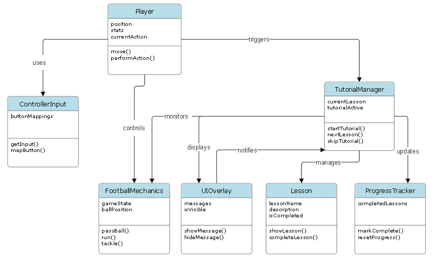

# EA Software Engineering Forage Job Simulation
This simulation is a hands on, self paced introduction to EA software engineering, letting me practice problem solving, coding in C++, and exploring real world game development tasks to build skills and career readiness. 

## Task 1: Write a Feature Proposal
In task one, I was asked to develop a feature proposal for EA SPORTS College Football. The proposal focuses on improving the experience for new players. It outlines an in-game tutorial that teaches core gameplay controls alongside fundamental football concepts. It evaluates the current lack of onboarding, explains the value of a structured tutorial for accessibility and player retention, and weighs the potential benefits and tradeoffs of implementing the feature within the existing game systems.

[View Feature Proposal Here](EA%20virtual%20internship%20task%201.pdf)

## Task 2: Create a Game Object Class
In this task, I designed a UML class diagram to model the architecture of the proposed tutorial feature. The diagram breaks the system into core classes, defines their responsibilities, and visualizes how they interact. This helps to clarify object relationships, state, and behavior before implementation. 

SmartDraw was used to make the following UML Diagram:

## Task 3: Improve Inventory System

## Task 4: Live Bugfix
